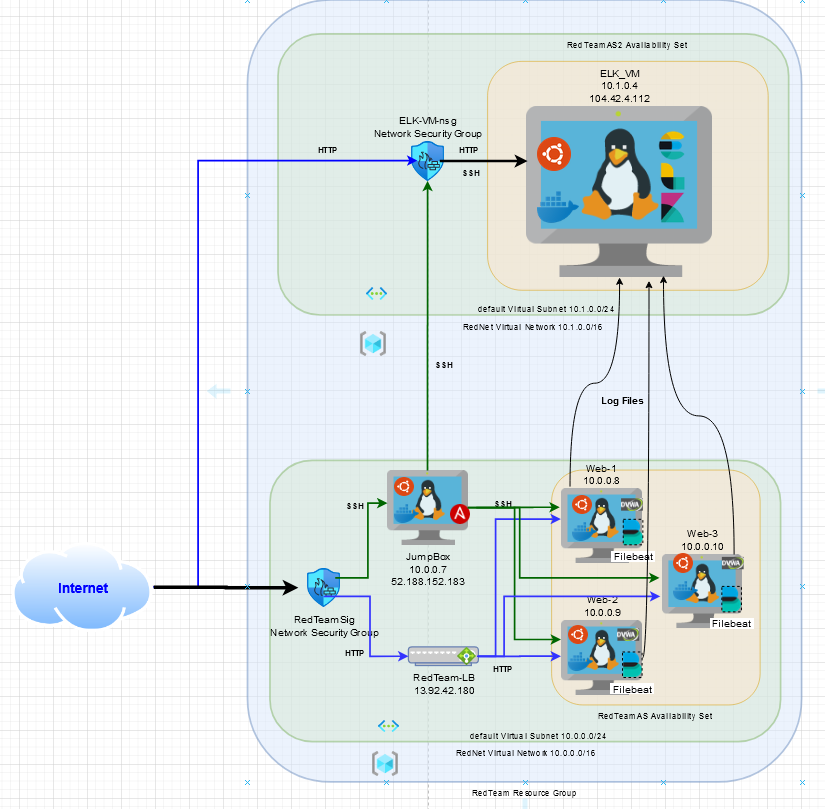
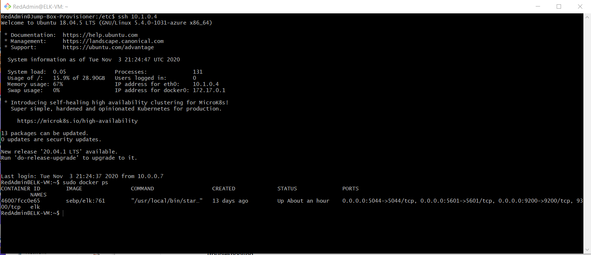

## Automated ELK Stack Deployment

The files in this repository were used to configure the network depicted below.  

These files have been tested and used to generate a live ELK deployment on Azure. They can be used to either recreate the entire deployment pictured above. Alternatively, select portions of the **/etc/ansible/install-elk.yml** file may be used to install only certain pieces of it, such as Filebeat.

  - /etc/ansible/install-elk.yml

This document contains the following details:
- Description of the Topology
- Access Policies
- ELK Configuration
  - Beats in Use
  - Machines Being Monitored
- How to Use the Ansible Build

### Description of the Topology

The main purpose of this network is to expose a load-balanced and monitored instance of DVWA, the D*mn Vulnerable Web Application.

Load balancing ensures that the application will be highly **redundant**, in addition to restricting **traffic** to the network.
- What aspect of security do load balancers protect? **redundancy (fault tolerance)**
- What is the advantage of a jump box? **A jump box is a hardened and monitored device that controls access to other internal devices**

Integrating an ELK server allows users to easily monitor the vulnerable VMs for changes to the **filesystem** and system **resources / availability**.
- What does Filebeat watch for? **log files and filesystem changes**
- What does Metricbeat record? **system-level CPU usage, memory, file system, disk IO, and network IO statistics**

The configuration details of each machine may be found below.
_Note: Use the [Markdown Table Generator](http://www.tablesgenerator.com/markdown_tables) to add/remove values from the table_.

| Name     | Function | IP Address | Operating System |
|----------|----------|------------|------------------|
| Jump Box | Gateway  | 10.0.0.7 / 52.188.152.183   | Linux            |
| Web-1    | DVWA     | 10.0.0.8   | Linux          |
| Web-2    | DVWA     | 10.0.0.9   | Linux          |
| Web-3    | DVWA     | 10.0.0.10  | Linux          |
| ELK-VM   | ELK Server | 10.1.0.4 / 104.42.4.112 | Linux          |

### Access Policies

The machines on the internal network are not exposed to the public Internet.

Only the **JumpBox** machine can accept connections from the Internet. Access to this machine is only allowed from the following IP addresses:
- **My home network public IP address**

Machines within the network can only be accessed by **JumpBox**.
- JumpBox 52.188.152.183 / 10.0.0.7

A summary of the access policies in place can be found in the table below.

| Name     | Publicly Accessible | Allowed IP Addresses |
|----------|---------------------|----------------------|
| Jump Box | Yes (SSH)           | SSH:My home network IPaddr|
| Web-1    | Yes (HTTP)          | HTTP:any, SSH:10.0.0.7   |
| Web-2    | Yes (HTTP)          | HTTP:any, SSH:10.0.0.7   |
| Web-3    | Yes (HTTP)          | HTTP:any, SSH:10.0.0.7   |
| ELK-VM   | Yes (HTTP, SSH)     | HTTP:any, SSH:10.0.0.7   |

### Elk Configuration

Ansible was used to automate configuration of the ELK machine. No configuration was performed manually, which is advantageous because...
- **Infrastructure as Code (easier to read & can be revision controlled)**

The playbook implements the following tasks:
- Configure syslog to use more memory
- Install docker.io
- Install python3-pip
- Install Docker python module
- Install ELK Stack
- Enable Docker service

The following screenshot displays the result of running `docker ps` after successfully configuring the ELK instance.

### Target Machines & Beats
This ELK server is configured to monitor the following machines:
- **Web-1 (10.0.0.8)**
- **Web-2 (10.0.0.9)**
- **Web-3 (10.0.0.10)**

We have installed the following Beats on these machines:
- **Filebeat**

These Beats allow us to collect the following information from each machine:
- **Filebeat reads and forwards log files, and monitors file system changes.**

### Using the Playbook
In order to use the playbook, you will need to have an Ansible control node already configured. Assuming you have such a control node provisioned:

SSH into the control node and follow the steps below:
- Copy the **install-elk.yml** file to **/etc/ansible**.
- Update the **/etc/ansible/hosts** file to include **the ELK server (and the webservers)**
- Run the playbook, and navigate to **http://104.42.4.112:5601/app/kibana** to check that the installation worked as expected.

- Which file is the playbook? Where do you copy it? **/etc/ansible/install-elk.yml**
- Which file do you update to make Ansible run the playbook on a specific machine? How do I specify which machine to install the ELK server on versus which to install Filebeat on? **/etc/ansible/hosts**
- _Which URL do you navigate to in order to check that the ELK server is running? **http://104.42.4.112:5601/app/kibana**

_As a **Bonus**, provide the specific commands the user will need to run to download the playbook, update the files, etc._
